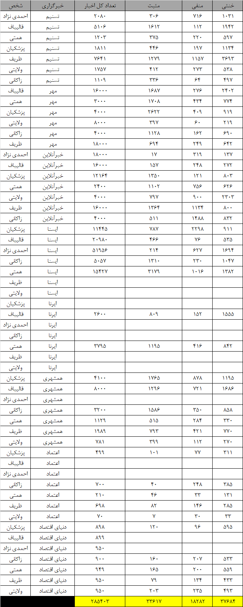

# Persian Politics News With Sentiment Analysis
اخبار خبرگزاری های فارسی با استفاده از NodeJS و کتابخانه ی Crawlee جمع آوری شده است. هر خبر شامل عنوان، متن کامل، خلاصه و لینک خبر است.
تحلیل احساسات با استفاده از مدل ```gemma2-9b-it``` و روی متن خلاصه خبر انجام شده است.
### اشخاص
- احمدی نژاد
- قالیباف
- پزشکیان
- همتی
- ولایتی
- زاکانی
- ظریف

### خبرگزاری ها
- تسنیم
- مهر
- دنیای اقتصاد
- خبر آنلاین
- ایرنا
- ایسنا
- همشهری
- اعتماد

### دیتاست
دیتاست با فرمت JSON از لینک زیر قابل دانلود است:
https://drive.google.com/drive/folders/1FJJYOdIW0oHf_GQ1yY_738YnyC0PgYD5?usp=sharing

فایل هایی که شامل ```with-sentiment``` هستند شامل احساسات و فایل هایی که شامل ``with-text`` هستند شامل متن کامل خبر هستند.


